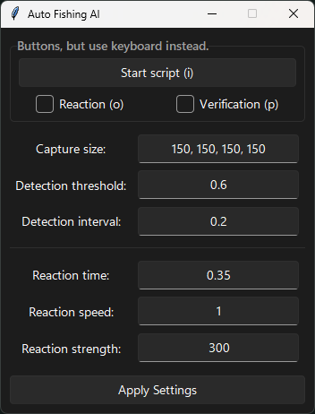
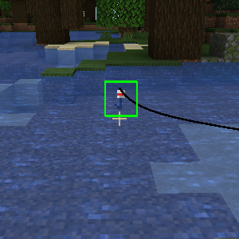
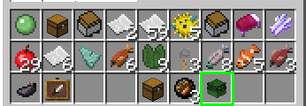
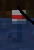

# Minecraft Auto AI Fish

Automated fishing bot for Minecraft, specifically designed for a certain Polish Minecraft RPG server. This script can also be used on regular Minecraft or other servers, with verification disabled.

## Features

- Automatically detects and catches fish in Minecraft.
- Modern GUI for control program and easy customization of settings.
- Preview window that displaying object tracking.
- Keyboard shortcuts for toggling detection, reaction, and verification.
- Config file to storage user settings.
- Safety quit if something goes wrong, to avoid a ban.

## Screenshots

*Graphical User Interface for adjusting settings.*

*Demonstration of the fishing detection in action.*

*Verification process showing how the skull is selected in the inventory.*

## Settings

- **Capture Size:** Customize the size of the capture area.
- **Detection Threshold:** Adjust the sensitivity of fish detection.
- **Detection Interval:** Set the time interval for fish detection.
- **Reaction Time:** Specify the time delay for reaction after fish detection.
- **Reaction Speed:** Control the speed of the reaction.
- **Reaction Strength:** Adjust the strength of the reaction.

## Installation

1. Clone the repository or download the source code.
2. Install the required dependencies: `pip install -r requirements.txt`.

## How to use

1. Run the `main.py` script to launch the GUI. I also recommend running it as an administrator to avoid potential issues.
2. Adjust the settings as needed.
3. Before starting the detection, take a screenshot of the fishing bobber in your Minecraft game and save it as `bobber.png`. Place this image in the `assets` folder.
4. Ensure that Minecraft is running in full screen mode.
5. After adjusting settings and before selecting reaction or verification, verify that the fishing bobber image (`bobber.png`) is correctly detected on your screen. You can do this by checking the preview window after clicking "Run script (i)" or pressing the i key.

## Tips
- Make sure the bobber image (`bobber.png`) is clear, well-lit, and matches the actual appearance of the bobber in your Minecraft game.

    

    *Example photo of a bobber.*

- Use keyboard shortcuts to control the bot:
   - Press "i" to toggle detection.
   - Press "o" to toggle reaction.
   - Press "p" to toggle verification.

## License

This project is licensed under the [MIT License](LICENSE).

## Contribution

Contributions are welcome! Feel free to submit issues or pull requests.

## Disclaimer

This script is not affiliated with or endorsed by Mojang or Minecraft. Use it responsibly and in compliance with the terms of service of the Minecraft server you are playing on.

